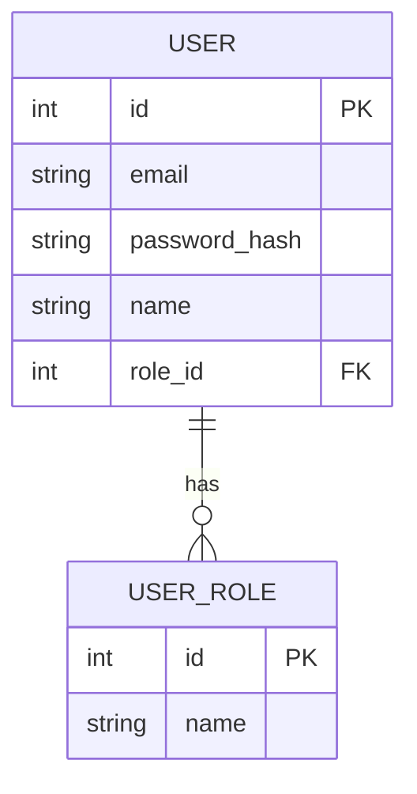
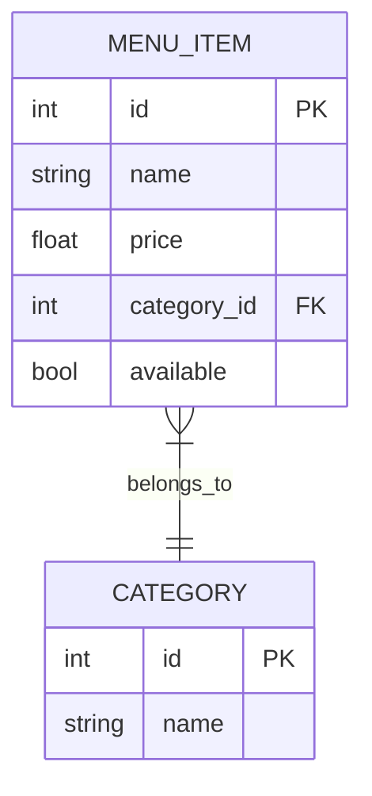

# **Designing the Bivy Restaurant Microservices: My Contribution to the ERD and Vision for User/Menu Services**  

## **Introduction**  
As part of the **Bivy Restaurant Microservices** project, our team is building a scalable backend system using **FastAPI (Python)** and **NestJS (TypeScript)**. My role involves leading the **User Service** and **Menu Service**, as well as contributing to the **Entity-Relationship Diagram (ERD)** design. In this post, I’ll share:  
1. **My contributions to the ERD**  
2. **The microservices I’m leading (User & Menu)**  
3. **My vision for these services (domain logic + API endpoints)**  

---

## **1. My Contribution to the ERD Design**  
The ERD is the backbone of our system, ensuring data consistency across microservices. Here’s how I contributed:  

### **a) User Service Schema**  
I designed the **User** and **UserRole** tables to support:  
- **Authentication** (email, hashed passwords)  
- **Role-based access control (RBAC)** (admin, staff, customer)  
- **User metadata** (name, phone, timestamps)  

**Key Decisions:**  
✔ Used `password_hash` instead of plaintext passwords (security)  
✔ Normalized roles into a separate table (flexibility)  

### **b) Menu Service Schema**  
I structured the **Menu** tables to allow:  
- **Categorization** (e.g., "Appetizers," "Main Course")  
- **Dynamic item management** (price, availability, images)  

**Key Decisions:**  
✔ Added `available` flag for inventory sync  
✔ Avoided storing inventory data (delegated to Inventory Service)  

### **c) Cross-Service Relationships**  
I collaborated with the **Order** and **Inventory** teams to define:  
- **Order → User** (`user_id` foreign key)  
- **Order → Menu** (`menu_item_id` in `order_items`)  
- **Inventory → Menu** (`menu_item_id` as primary key)  

---

## **2. The Microservices I’m Leading**  
### **a) User Service (FastAPI)**  
**Purpose**: Handle authentication, user profiles, and role management.  

**Key Features:**  
✅ JWT-based authentication  
✅ Role-based permissions (admin, staff, customer)  
✅ User CRUD operations  

### **b) Menu Service (FastAPI)**  
**Purpose**: Manage restaurant menus, categories, and item availability.  

**Key Features:**  
✅ Dynamic menu categorization  
✅ Image upload support  
✅ Integration with Inventory Service  

---

## **3. My Vision for These Services**  
### **User Service: Domain & Endpoints**  
| Endpoint                | Method | Description                          |
|-------------------------|--------|--------------------------------------|
| `/auth/register`        | POST   | Register new user                    |
| `/auth/login`           | POST   | Generate JWT token                   |
| `/users/{id}`           | GET    | Fetch user profile                   |
| `/users/me`             | GET    | Get current user (JWT-protected)     |
| `/admin/users`          | GET    | List all users (admin-only)          |

 

### **Menu Service: Domain & Endpoints**  
| Endpoint                | Method | Description                          |
|-------------------------|--------|--------------------------------------|
| `/menu/items`           | GET    | List all menu items (filterable)     |
| `/menu/items`           | POST   | Add new menu item (admin-only)       |
| `/menu/items/{id}`      | PATCH  | Update availability/price            |
| `/menu/categories`      | GET    | List all categories                  |

## **Conclusion**  
By designing a clean ERD and focusing on **User** and **Menu** services, I aim to create a secure, flexible foundation for Bivy’s restaurant system. 
Stay tuned for updates as we build this system!  

🔗 **Follow the project:**  
- [GitHub Repo (User Service)](https://github.com/bivy/bivy-user-service)  
- [GitHub Repo (Menu Service)](https://github.com/bivy/bivy-menu-service)  

#Microservices #FastAPI #NestJS #SoftwareArchitecture